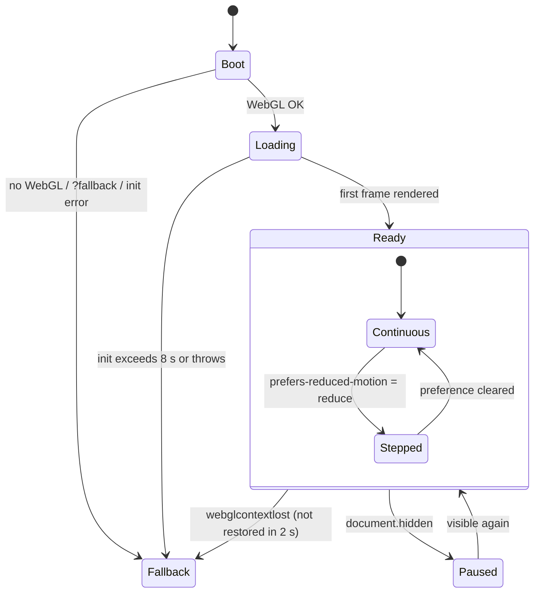

# Cursor Grey-box Brief — Milestone 1

This is the implementation brief for the first grey-box milestone of the
Victoria Harbour 3D website. It is written to be handed to Cursor as the next
step. It does not authorise final art, final copy, or polish.

**Goal of the milestone:** prove the six-chapter camera journey, portrait and
landscape compositions, copy-safe regions, scroll behaviour, reduced-motion
mode, and fallback, using only procedural placeholder geometry, before any
production asset is made.

**Status:** Approved for implementation (2026-10-01). All section 17 decisions
are resolved. Scaffolding may begin with step 1 of section 18.

---

## 1. Source documents and precedence

Read before implementing: `HANDOFF.md`, `README.md`, `docs/WORLD-BIBLE.md`,
`docs/PRE-PRODUCTION-DECISIONS.md`, `docs/STORYBOARD.md`,
`docs/ASSET-LEDGER.md`, and the 12 approved frames plus their prompts in
`docs/storyboards/`.

When documents disagree, use this order of precedence:

1. This brief (it resolves the known contradictions below).
2. The approved storyboard images in `docs/storyboards/*.png`.
3. The storyboard prompt files in `docs/storyboards/*-prompt.md`.
4. `docs/STORYBOARD.md` shot table and transition rules.
5. `docs/PRE-PRODUCTION-DECISIONS.md`, `docs/WORLD-BIBLE.md`,
   `docs/ASSET-LEDGER.md`.
6. `HANDOFF.md` (the earliest document, partly superseded).

---

## 2. Contradictions found and how this brief resolves them

These came from comparing the approved storyboard frames with the existing
project documents. Items marked **(approved 2026-10-01)** change something the
user previously described and were approved by the user. The others follow the
approved frames.

1. **Chapter count.** `HANDOFF.md` describes five chapters, with IFC and
   Afterglow merged. `README.md`, `PRE-PRODUCTION-DECISIONS.md`, and
   `STORYBOARD.md` describe six. **Resolution:** six chapters.

2. **Chapter numbering.** The `STORYBOARD.md` shot table and
   `ASSET-LEDGER.md` number chapters `00–05`. The storyboard file names, the
   progress table, `README.md`, and `PRE-PRODUCTION-DECISIONS.md` use `01–06`.
   **Resolution:** use `01–06` everywhere in code, HTML, and debug output.
   Ledger "Chapters" values should be shifted by +1 in a later docs pass.

3. **How the experience ends.** `HANDOFF.md` says the camera "pulls back into
   a final panorama", and `PRE-PRODUCTION-DECISIONS.md` says it "pulls back,
   reconnects the world". The approved Frame 06 (desktop and mobile) tilts up
   into a sky-dominated fireworks view with no water and no panorama.
   **Resolution:** follow Frame 06. There is no closing panorama.

4. **Frame 06 camera move.** The Frame 06 prompt says to "continue the Frame 5
   approach, then tilt sharply upward". But the approved Frame 06 image shows
   IFC much smaller and a wider skyline (Bank of China visible) than Frame 05.
   That framing needs the camera to **pull back** (or widen the field of view)
   while pitching up. Tilting up from the Frame 05 position would make IFC
   larger, not smaller. **Resolution:** pull back and pitch up together
   (section 9, 05→06). **(approved 2026-10-01)**

5. **Fireworks and the grey-box exclusions.** Frame 06 depends on fireworks.
   Fireworks are particles, which this milestone excludes. **Resolution:** use
   4 static flat disc "burst markers" as composition placeholders. They have no
   particles, trails, or shaders. Real fireworks are a later milestone, and
   they have no asset-ledger entry yet.

6. **The Observation Wheel is missing from the planning docs.** It is absent
   from the `HANDOFF.md` hero list, `WORLD-BIBLE.md`, the
   `PRE-PRODUCTION-DECISIONS.md` grey-box list, the `ASSET-LEDGER.md`, and the
   `STORYBOARD.md` shot table. Yet it appears in approved Frames 01, 03, and 05,
   and is a co-star in Frame 05. **Resolution:** the grey-box includes a wheel
   proxy. The ledger needs Phase A and Phase B wheel entries later.

7. **Frame 03 desktop ferry placement.** `STORYBOARD.md` says the ferry is in
   the "lower-right third" and that "Kowloon recedes behind it". The approved
   image and prompt put the ferry across the **lower-left half** (50–60% of the
   width), with no Clock Tower or Kowloon visible and IFC large in the right
   background. **Resolution:** follow the image.

8. **Frame 03 mobile.** `STORYBOARD.md` asks for a "more frontal three-quarter
   ferry angle". The approved image shows a near side-on ferry in the
   lower-left with the bow pointing right. **Resolution:** follow the image.
   Also, `frame-03-across-the-water-mobile-rough-prompt.md` does not exist. It
   is the only frame without a prompt record.

9. **Frame 01 contents.** `STORYBOARD.md` places the Clock Tower "low-left" and
   the junk "near centre", and does not mention a ferry. The approved desktop
   image shows a full-height Clock Tower at the left edge (crown near the top),
   the Star Ferry centre-left, and the junk right of centre, matching the
   prompt's order of Clock Tower, Star Ferry, junk, Wheel/IFC. Mobile Frame 01
   removes the ferry. **Resolution:** follow the images. The ferry is shown on
   desktop and hidden on mobile in chapter 01.

10. **Asset ledger chapter lists don't match the frames.** Converted to `01–06`:
    the Star Ferry is listed for 02–03 but is also in desktop 01 and exits
    during 04. The junk is listed for 01, 04, and 06, but Frame 06 has no junk.
    IFC is listed for 01 and 04–06 but is prominent in 03. **Resolution:** this
    brief's visibility table (section 7.7) is authoritative for the grey-box.

11. **Frame 05 proportions and copy zone.** `STORYBOARD.md` says IFC "anchors
    the right third" and doesn't mention the wheel. The approved image puts IFC
    right of centre (about 62–72% x) with the wheel as a large lower-left
    co-star. The desktop prompt asks for IFC at "105–115% of frame height",
    which can't coexist with its own "fully visible crown" rule. The image shows
    about 85%. The mobile prompt asks for IFC at 65–78% height and the wheel at
    28–36% height; the image shows about 48% and about 17% (about 37% of the
    width). `STORYBOARD.md` puts copy "left-centre" (on mobile, "over the
    mountain/water band"), but both prompts and images reserve the
    **upper-left**, and on mobile the wheel fills the mountain band.
    **Resolution:** follow the images for proportions and use upper-left copy.

12. **Frame 02 copy zones.** On desktop, `STORYBOARD.md` says "right-centre"
    and the prompt says "dark upper-right". Both are compatible with an
    upper-right region. On mobile, the approved image leaves only about 117 px
    of sky right of the tower at 390 px wide, which is too narrow for readable
    copy. **Resolution:** in the grey-box, lower the tower slightly so a
    full-width top band holds the copy (section 8). **(approved 2026-10-01)**

13. **Searchlights.** `STORYBOARD.md` asks for "one restrained searchlight
    sweep" in 01 and a "searchlight fan" in 05. The desktop Frame 01 image shows
    5+ beams, the mobile prompts exclude searchlights, and
    `PRE-PRODUCTION-DECISIONS.md` treats them as polish. **Resolution:** no
    searchlights in the grey-box.

14. **Foreground cards.** `PRE-PRODUCTION-DECISIONS.md` and the ledger plan
    foreground cards for chapters 01–04. The Frame 04 prompt forbids a
    foreground railing, and neither Frame 03 nor Frame 04 shows a foreground
    card (the pier/bow fragment suggested in `STORYBOARD.md` is not in the
    approved Frame 03). **Resolution:** foreground cards only in chapter 01
    (desktop railing) and chapter 02 (railing and palms, both viewports).

15. **Grey-box method.** `HANDOFF.md` (asset sequence steps 5–6) proposes a
    Blender grey-box scene and a GLB export test. `PRE-PRODUCTION-DECISIONS.md`
    and this milestone call for procedural geometry only. **Resolution:**
    everything is built in code. The single-GLB test is deferred to the asset
    milestone.

16. **Approval status.** `README.md` and `PRE-PRODUCTION-DECISIONS.md` said
    "awaiting approval, no implementation authorised", and the open decisions
    in `PRE-PRODUCTION-DECISIONS.md` §7 (including the target phone) were not
    recorded as resolved, while `STORYBOARD.md` said all frames were approved.
    **Resolution:** both status lines were updated on 2026-10-01. The target
    phones are the iPhone 11 (primary) and iPhone 13 (secondary).

17. **Persistent world vs. per-frame removals.** Several frames "remove"
    objects that physically exist in the one persistent world: IFC and the
    wheel in 02, the junk in 02–03, the ferry in mobile 01–02, the water and
    wheel in 06. **Resolution:** hide them with camera framing and subject paths
    first. Use per-chapter opacity gating (section 7.7) only where framing
    can't do it.

18. **Style note (not a grey-box issue).** The approved frames are
    "stylised-photorealistic matte painting" with heavy bloom and no halftone.
    `WORLD-BIBLE.md` asks for an "illustrated neo-vintage poster" look with
    restrained halftone. This should be resolved before the look-development
    milestone. It does not affect the grey-box.

---

## 3. Milestone scope

### In scope

- Vite + vanilla Three.js, one renderer, one scene, one animation loop.
- Procedural placeholder geometry only (section 6), built at runtime from
  Three.js primitives, `ShapeGeometry`, `InstancedMesh`, and runtime
  `CanvasTexture`s.
- Six semantic HTML chapter sections with placeholder copy.
- A config-driven scroll conductor that maps native scroll to one continuous
  camera path.
- Six desktop camera keyframes and six mobile camera keyframes.
- Simple scroll-driven motion for the ferry and junk, with gentle bobbing.
- Per-chapter visibility gating and fog density.
- Placeholder foreground cards for chapters 01–02.
- Copy-safe regions applied from config.
- Reduced-motion stepped mode.
- Poster/fallback placeholder (inline SVG, no image file).
- Dev-only debug tools: diagnostics panel, storyboard overlay, composition
  probe, pose logger, and free camera.
- A `?fps` performance overlay that also works in production builds, for
  measuring on the iPhones.

### Explicitly excluded

- Meshy, Blender, downloaded, photogrammetry, or any GLB/GLTF/OBJ/FBX model.
  Do not import `GLTFLoader` or create `loadModels.js` yet.
- Any image, texture, or font file in `public/`. Use system fonts.
- Final copy, plates, cutouts, or posters.
- Bloom, `EffectComposer`, film grain, halftone, vignette, or any
  post-processing pass.
- Particles (`Points`, sprite systems, instanced particles), rain, embers,
  smoke, spray.
- Custom shaders: no `ShaderMaterial`, `RawShaderMaterial`, or
  `onBeforeCompile`.
- Shadows (`renderer.shadowMap.enabled` stays `false`).
- Sound or audio of any kind.
- Complex navigation, menus, chapter nav, custom cursor, pointer parallax,
  smooth-scroll libraries, scroll hijacking, GSAP/ScrollTrigger, or loading
  spectacle.
- Searchlights, traffic traces, building-window detail, crowds, cloth or sail
  simulation.
- Copying any Kage code or artwork (licence: no reuse granted).

---

## 4. Technical baseline and file structure

- Node.js LTS, current stable Vite (vanilla JS template), current stable
  `three` from npm, both pinned to exact versions.
- No other runtime dependencies. `OrbitControls` from `three/addons` is
  allowed **only** inside the dev-only debug module.
- Plain ES modules, no TypeScript or framework.

```text
index.html                     semantic chapters, poster, canvas, footer
src/
├─ main.js                     boot, state machine, render loop
├─ styles.css                  layout, copy regions, poster, reduced motion
├─ data/
│  └─ chapters.js              THE single chapter/camera/copy config
├─ scene/
│  ├─ createScene.js           renderer, scene, camera, sky, fog, resize
│  ├─ createLighting.js        hemisphere + one directional light
│  ├─ createWater.js           water plane + runtime canvas normal map
│  ├─ createKowloonEdge.js     promenade, seawall, pier, Clock Tower
│  ├─ createIsland.js          island slab, skyline, mountains, IFC, wheel
│  ├─ createVessels.js         Star Ferry and junk proxies + their paths
│  └─ createForeground.js      foreground cards, firework markers
├─ scroll/
│  ├─ scrollConductor.js       scroll → progress → chapter/phase state
│  └─ cameraRig.js             keyframes → camera pose, damping, stepping
└─ ui/
   ├─ chapters.js              copy regions, copy fades, active chapter attrs
   ├─ fallback.js              WebGL detection, context loss, poster
   ├─ fpsOverlay.js            ?fps performance readout (allowed in production)
   └─ debug.js                 dev-only tools (tree-shaken from production)
```

This extends the architecture in `HANDOFF.md`. Don't put the whole project in
one file. No module should know scroll thresholds except via `chapters.js`.

---

## 5. World layout and scale

Units are metres. Y is up, water is at `y = 0`, and **−Z points toward Hong
Kong Island**. **+X is screen-right in the arrival view**, which is also the
direction of travel toward Central. Every vessel and camera move in the
crossing trends toward +X and −Z, so "rightward" stays consistent in every
frame.

Geography is compressed but keeps the Kowloon-to-Island orientation. Real
heights are kept so that proportions read correctly.

The values below are **starting estimates**. Tune them with the debug tools
until the composition checks in section 7 pass. Then record the final values in
`chapters.js` and the layout constants.

```text
                         −Z (Hong Kong Island)
   mountains far   z ≈ −2000 … −2600
   skyline band    z ≈ −1120 … −1500     IFC (500,0,−1180)  wheel (380,33,−1120)
   island edge     z ≈ −1100
                    ~~~~~~~~~~~~~~~~~ harbour ~~~~~~~~~~~~~~~~~
                       junk path ─────────────►  (+X, −Z)
                       ferry path ────────────►  (+X, −Z)
   pier            x −40…+10, z −10…5
   Clock Tower     (−40, 2.5, 15)
   Kowloon land    x −250…−30, z −10…140      camera F01 ≈ (−20, 10, 110)
   promenade       x −120…+60, z 95…140 (railing at z 95)
                         +Z (Kowloon)
```

| Element | Starting position / extent | Notes |
|---|---|---|
| Water plane | 8000 × 8000, centred at (0, 0, −1000) | Fog hides the edges |
| Kowloon land and promenade | as sketched, top at y 2.5 | Dark low boxes |
| Clock Tower | base centre (−40, 2.5, 15) | About 44 m tower plus a 7 m spire |
| Star Ferry pier | x −40…+10, z −10…5, top at y 2 | Low block |
| Island waterfront slab | x −900…+1200, z −1100…−1500, y 0…3 | |
| IFC | base centre (500, 0, −1180) | 412 m tall |
| Observation Wheel | hub (380, 33, −1120), ring facing +Z | 60 m diameter, sits on the waterfront |
| Skyline band | x −900…+1200, z −1120…−1500 | Steps up toward IFC |
| Mountain layers | flat silhouettes at z −2000 and z −2600 | Peaks 380–520 m, below IFC's crown in the Frame 01 view |
| Camera near/far | 0.5 / 5000 | |
| Fog | `THREE.FogExp2`, starting density about 0.00045 | Density is keyed per chapter |

---

## 6. Placeholder geometry specification

Use flat or low-poly geometry with shared `MeshLambertMaterial` or
`MeshStandardMaterial` (roughness ≥ 0.6, metalness 0). Use
`MeshBasicMaterial` for emissive strips. The palette is grey-box values with
only a few colour codes so hero subjects stay identifiable:

| Token | Use | Value |
|---|---|---|
| `sky-top` / `sky-horizon` | Sky dome vertex colours | `#141833` / `#3A2342` |
| `fog` | Fog and background | `#1E1B36` |
| `proxy-dark` / `proxy-mid` / `proxy-light` | Land, skyline, structures | `#2A2D3A` / `#5B6070` / `#9CA1AE` |
| `warm-emissive` | Window strips, lamps, clock faces | `#F2B36B` |
| `sail-coral` | Junk sails only | `#E4573D` |
| `crown-cream` | IFC crown, ferry deck band | `#F3E9D2` |
| `rim-cyan` | Directional rim light colour | `#6FD3E0` |

**Water.** One `PlaneGeometry` (1×1 segments) with a `MeshStandardMaterial`
(roughness about 0.35). Add a normal map generated once at startup on a 256 px
`CanvasTexture` of tileable noise, repeat about 400×400, and drift its `offset`
slowly over time. No vertex displacement and no custom shader. Exit test: it
reads as water under the rim light without post-processing.

**Sky.** A large `SphereGeometry` (radius 4500, `BackSide`,
`MeshBasicMaterial`, `vertexColors`, `fog: false`) with a vertex-colour
gradient from `sky-horizon` to `sky-top`.

**Lighting.** One `HemisphereLight` (violet sky, near-black ground) and one
`DirectionalLight` in `rim-cyan` from behind the island at a low angle. No
shadows and no other lights. Warmth comes from emissive materials.

**Clock Tower** (chapters 01–02):

- Shaft: square prism 8 × 36 × 8 m, very slight taper.
- Upper stage: 6.5 × 5 × 6.5 m box with four small corner pinnacles.
- Dome: half-sphere, radius 3 m, 12 segments.
- Spire: thin cylinder, radius 0.15 m, height 7 m.
- Clock faces: two `warm-emissive` circles (radius 1.4 m) on the two faces
  visible to the camera, about 70% of the way up the shaft.
- Base: a darker plinth 10 × 3 × 10 m.
- Exit test: recognisable from its proportions alone at a height of 60–90% of
  the frame (desktop 02) and in silhouette at the left edge (desktop 01).

**Star Ferry** (chapters 01–04):

- Double-ended hull 40 × 4 × 10 m: a box with both ends tapered (an extruded
  rounded-rectangle `Shape`), in `proxy-dark`.
- Lower deck 34 × 3 × 9 m and upper deck 30 × 2.8 × 8.5 m in `proxy-light`.
- Roof slab 32 × 0.3 × 9.6 m.
- One short funnel cylinder (radius 1, height 2) and an optional thin mast.
- `warm-emissive` window strip planes along both deck sides.
- Points along +X when travelling (bow right).
- Exit test: reads as a two-deck ferry when it fills about 55% of the width
  (desktop 03), and its path never clips the camera or a foreground card.

**Junk** (chapters 01, 04):

- Hull: an extruded side-profile `Shape` with a raised stern, 28 m long and
  7 m beam, in `proxy-dark`, plus a `warm-emissive` cabin strip.
- Three masts (thin cylinders).
- Three battened-fan sails as `ShapeGeometry`, `DoubleSide`, `sail-coral`:
  - main sail about 16 m tall × 10 m wide;
  - fore sail about 11 × 7 m;
  - mizzen about 9 × 6 m.
- Sails lie fore-aft, parallel to the hull, so they read flat in side views.
- Thin dark batten lines are optional (`LineSegments`, one draw call).
- Exit test: all three sails are distinct on desktop 04, and the main sail
  reads in full without touching the top edge on mobile 04.

**IFC** (chapters 01, 03–06):

- Four stacked square prisms built from `CylinderGeometry(rTop, rBottom, h, 4)`
  rotated 45° so each tier tapers:
  - 0–300 m, about 56 m wide;
  - 300–350 m, 50 m;
  - 350–385 m, 44 m;
  - 385–400 m, 38 m.
- Crown 400–412 m: four thin corner fins plus a `crown-cream` emissive cap.
- Faint `warm-emissive` vertical strips on the two camera-facing sides, as
  4–6 thin planes, not window grids.
- Exit test: the crown stays fully visible at both aspect ratios in chapters
  01, 03, and 05, and is recognisable as the only lit crown in chapter 06.

**Observation Wheel** (chapters 01, 03, 05):

- `TorusGeometry(30, 0.6, 6, 48)` ring.
- 16 spokes as a single `LineSegments`, or one `InstancedMesh` of thin boxes.
- Hub cylinder and two A-frame support legs (thin boxes) on a base block.
- Optional 16 gondolas as one `InstancedMesh`.
- Ring material is a muted coral-magenta emissive, so it is visibly different
  from the sails.
- Static: no rotation in the grey-box.
- Exit test: a small, readable circle near IFC's base in 01; a co-star about
  46% of the frame height on desktop 05 and about 37% of the width on
  mobile 05.

**Skyline:**

- One `InstancedMesh` of about 180–240 boxes in the island band.
- Heights 40–220 m, rising toward the IFC cluster (x 200…700) and falling
  toward the edges.
- Per-instance grey tint via `instanceColor`, with a few slightly warm.
- Keep every box at least 20% shorter than IFC.
- A second, lower `InstancedMesh` of about 40 boxes on Kowloon behind the
  promenade, used only for the chapter 02 skyline glimpse.
- Exit test: the skyline, mountain, and IFC separate as distinct depth layers
  in grayscale.

**Mountains.** Two flat `ShapeGeometry` ridgelines (near and far), facing +Z,
in `proxy-dark` and a slightly lighter tone, softened by fog.

**Foreground cards** (chapters 01–02):

- Railing: a row of box posts plus two rails, real geometry along the
  promenade edge (z 95). Visible on desktop 01 and on 02 (both viewports).
- Palm cards: 3–4 dark flat `ShapeGeometry` silhouettes (trunk plus a fan of
  triangles) near the tower. Used in 02 on both viewports.
- Exit test: no card pops in or out visibly, intersects the camera's near
  plane, or covers a copy-safe region at a hold pose.

**Firework burst markers** (chapter 06 only):

- 4 `RingGeometry` or `CircleGeometry` discs, `MeshBasicMaterial`,
  `transparent`, `depthWrite: false`, `fog: false`, always facing the camera.
- Roughly 1 warm-white (largest), 2 coral-pink, and 1 smaller cyan.
- Placed high above the island, around y 500–900 and z −1400. Tune to
  section 7.6.
- No particles, trails, or animation beyond an opacity fade in during the
  05→06 transition.

**Wakes (optional).** One thin flat white plane per vessel trailing behind it,
at low opacity. No foam particles.

---

## 7. The six chapters

Narrative order: **01 → 06**, one continuous night crossing from the Kowloon
waterfront, across the water, to Hong Kong Island, then up into the afterglow.

| # | Title | Story beat | Dominant subject | Supporting motion |
|---|---|---|---|---|
| 01 | Harbour at Dusk — Arrival | Orient the viewer; the harbour is the protagonist | Whole harbour panorama | Very slow forward dolly; water drift |
| 02 | The Kowloon Edge — Clock Tower | Human-scale heritage departure point | Clock Tower | Ferry departing right (desktop only) |
| 03 | Across the Water — Star Ferry | Leave the shore, wave height | Star Ferry | Ferry and camera travelling right together |
| 04 | Red Sails — The Junk | Visual and emotional crest | Junk sails | Parallel pass; ferry exits right |
| 05 | City of Light — IFC | Scale shifts to the vertical city | IFC, with the wheel as co-star | Camera rising toward Central |
| 06 | Afterglow — Departure | Release; look up and end quietly | Sky and burst markers above IFC's crown | Pull back and tilt up; motion settles |

### Composition targets

All positions are **% of the viewport from the top-left** at a chapter's hold
pose. Tolerance is ±3% of the viewport unless stated. They were measured from
the approved PNGs, and the debug composition probe (section 14) must report
values within tolerance. Camera hints are starting points only.

Every pose has camera roll fixed at 0.

#### 7.1 Chapter 01 — Harbour at Dusk

**Desktop (1440 × 900).** Wide establishing view from the Kowloon promenade
looking toward Central. Camera hint: (−20, 10, 110), looking at about
(80, 40, −600), vertical FOV about 40°.

- Clock Tower: x 8–18%, crown top 5–9%, base about 60%.
- Star Ferry: x 33–49%, waterline about 64%, bow right.
- Junk: x 61–77%, waterline about 64%.
- IFC: x 70–74%, crown about 18%.
- Wheel: centre x about 64%, base on the island waterline at about 56%,
  diameter about 5% of height.
- Island waterline at about 56%. Railing card across the bottom 70–100%.
- Narrative left-to-right reading order: tower, ferry, junk, wheel/IFC.

**Mobile (390 × 844).** A portrait landmark triangle, not a desktop crop. Raise
the horizon relative to the scene and reduce lateral movement. Camera hint:
same area, pulled back and pitched up slightly, vertical FOV about 60°.

- Clock Tower: x 5–19%, crown about 42%, base about 72%.
- Junk: x 44–75%, waterline about 74%.
- IFC: x 81–88%, crown about 46%.
- Wheel: centre x about 76%, about 68%.
- Island waterline at about 70%.
- No ferry (gated) and no railing card.

#### 7.2 Chapter 02 — The Kowloon Edge

**Desktop.** Advance and drift left to the tower at low height, looking up.
Camera hint: about (−20, 3, 60), pitched up 10–15°, yawed left enough to push
IFC and the wheel off the right edge.

- Clock Tower: x 15–35%, crown ≤ 3%, base about 85% (80–90% of frame height).
- Star Ferry: x 66–89%, y 67–83%, bow right, wake trailing left.
- Horizon at about 75%. Low, soft skyline only.
- IFC, wheel, and junk out of frame.
- Palm cards at x 0–13% and just right of the tower. Railing along the bottom.

**Mobile.** The tower is centred and is the only subject, seen from a modest
low angle. Camera hint: lower and closer, vertical FOV about 55°.

- Clock Tower: centred, x 33–64%, about 60–70% of frame height.
- Spire top at ≥ 20% and base at about 82%, which frees the top copy band in
  section 8. This is lower than in the approved PNG (approved deviation,
  2026-10-01), so the storyboard overlay will show the tower slightly higher
  than the grey-box.
- Pier, railing, and palms frame the lower third. Water is a 12–18% strip at
  the bottom.
- The right lane (x 82–100%) stays visually open for the ferry reveal.
- No recognisable vessel. The ferry is gated or off-frame right.

#### 7.3 Chapter 03 — Across the Water

**Desktop.** At wave height, close alongside and slightly behind the ferry,
travelling right toward Central. Camera hint: y about 2.5 m, about 25–35 m off
the ferry's side.

- Star Ferry: x 0–60% (50–60% of width), waterline about 78%, bow at about
  60% pointing right.
- Ferry roof y ≥ 26%; the mast, if present, stays at x ≥ 43%.
- IFC: x 82–87%, crown about 12%, base about 60%.
- Wheel: centre x about 76%, about 57%, diameter about 8% of height.
- Horizon at about 62%. No Clock Tower and no junk.

**Mobile.** Same idea in portrait, with a large sky field above.

- Star Ferry: x 0–66%, roof about 52%, waterline about 72%, bow right.
- IFC: x 86–90%, crown about 51%.
- Wheel: centre x about 81%, about 65%.
- Horizon at about 66%. Sky 0–48% is clear.

#### 7.4 Chapter 04 — Red Sails

**Desktop.** The camera slows, letting the ferry pull ahead and out right,
while the junk overtakes from behind-left. Then it travels parallel to the
junk. Camera hint: y about 4 m, about 45–60 m off the junk's side.

- Junk hull: x 37–93% (55–65% of width), waterline about 72%.
- Main sail: x 57–75%, top 8–12% (never touching the top edge).
- Fore sail x 36–47%; mizzen x 80–92%.
- IFC only as a partial cue at x ≥ 95%. Wheel absent or barely visible.
- Horizon at about 63%. Raise fog density to soften the skyline.

**Mobile.** Pulled slightly farther back so the full main sail reads.

- Junk: x 6–84%, waterline about 70%, angled gently right.
- Main sail: x 30–60%, top ≥ 38%.
- IFC: soft vertical cue at x 91–96%. No ferry, wheel, or tower.

#### 7.5 Chapter 05 — City of Light

**Desktop.** Rise from the water and push toward Central. Camera hint: about
650–700 m from IFC, y 25–45 m, pitched up slightly.

- IFC: x 62–72%, crown 2–5%, base about 87%. The crown is never cropped.
- Wheel: x 21–48%, top about 43%, bottom about 89% (about 46% of height).
- Skyline steps up toward IFC. Mountain ridge at about 37–45%.
- Water band at the bottom, about 8–10%.
- No vessels or tower.

**Mobile.** A lower camera with a stronger upward view.

- IFC: x 64–82%, crown about 25%, base about 75%. Breathing room above the
  crown.
- Wheel: x 10–46%, about 58–76% (about 37% of width).
- Narrow water band at the bottom, about 18%.

#### 7.6 Chapter 06 — Afterglow

**Desktop.** Pull back and pitch up 15–25° (or widen the FOV up to about 55°)
until the water leaves the frame.

- Sky fills 78–85% of the frame.
- Skyline band in the bottom 15–22%.
- IFC crown at x 62–66%, top about 66%, its lower part cropped by the bottom
  edge.
- Burst markers: warm-white hero about (85%, 22%), coral about (65%, 30%),
  cyan about (73%, 45%), small coral about (90%, 50%).
- No water, vessels, wheel, or tower.

**Mobile.** A stronger upward crop.

- IFC crown at x 62–75%, top about 67%.
- Skyline band in the bottom 15%.
- Burst markers: hero about (87%, 28%), coral about (55%, 34%), cyan about
  (68%, 43%), coral about (89%, 48%).
- Upper-left kept empty.

#### 7.7 Visibility and fog gating

Framing does most of the work. Gating is an opacity fade over a transition
window. Fade only while the object is off-centre, small, or occluded, and set
`visible = false` once opacity reaches 0.

✓ = visible, — = hidden by framing (no gating needed), **G** = gated (opacity
0), ↗ = exits during the chapter.

| Object | 01 D / M | 02 D / M | 03 D / M | 04 D / M | 05 D / M | 06 D / M |
|---|---|---|---|---|---|---|
| Clock Tower | ✓ / ✓ | ✓ / ✓ | — / — | — / — | — / — | — / — |
| Star Ferry | ✓ / **G** | ✓ / **G** | ✓ / ✓ | ↗ / ↗ | — / — | — / — |
| Junk | ✓ / ✓ | — / — | — / — | ✓ / ✓ | — / — | — / — |
| IFC | ✓ / ✓ | — (G if needed) | ✓ / ✓ | edge / edge | ✓ / ✓ | crown / crown |
| Wheel | ✓ / ✓ | — (G if needed) | ✓ / ✓ | — / — | ✓ / ✓ | — / — |
| Railing card | ✓ / **G** | ✓ / ✓ | — / — | — / — | — / — | — / — |
| Palm cards | **G** / **G** | ✓ / ✓ | — / — | — / — | — / — | — / — |
| Burst markers | **G** | **G** | **G** | **G** | **G** | ✓ / ✓ |
| Fog density | base | base | base | +40% | base | −20% |

Gated fades must finish before the gated object would cross a copy-safe region
or the next chapter's hero.

---

## 8. Copy-safe regions

Copy (index, heading, body, and any action) must sit entirely inside the
region at the hold pose. No proxy may intrude into the region at that pose,
except fog, sky, or mountain silhouettes darker than the text-contrast
threshold. Values are `left / top / right / bottom` in % of the viewport, with
reference pixels in brackets.

| # | Desktop 1440 × 900 | Mobile 390 × 844 |
|---|---|---|
| 01 | 20 / 8 / 50 / 31 — upper-left, right of the tower [x 288–720, y 72–279] | 8 / 6 / 92 / 36 — upper-centre [x 31–359, y 51–304] |
| 02 | 50 / 10 / 92 / 38 — upper-right sky [x 720–1325, y 90–342] | 8 / 4 / 92 / 18 — full-width top band above the lowered tower in 7.2 [x 31–359, y 34–152] |
| 03 | 5 / 6 / 42 / 22 — upper-left above the ferry [x 72–605, y 54–198] | 8 / 6 / 92 / 34 — upper sky [x 31–359, y 51–287] |
| 04 | 5 / 10 / 34 / 44 — left third, upper-left [x 72–490, y 90–396] | 8 / 6 / 92 / 34 — upper-left/centre, clear of the sails [x 31–359, y 51–287] |
| 05 | 5 / 6 / 50 / 32 — upper-left [x 72–720, y 54–288] | 6 / 5 / 62 / 40 — upper-left, left of IFC's crown [x 23–242, y 42–338] |
| 06 | 5 / 12 / 38 / 62 — upper-left to left-centre, closing line and action [x 72–547, y 108–558] | 6 / 4 / 60 / 30 — upper-left, closing line and action [x 23–234, y 34–253] |

Copy rules for the grey-box:

- Placeholder copy per chapter: a two-digit index, a heading of ≤ 4 words (use
  the chapter title), and body text of ≤ 35 words. Chapter 06 also has one
  action link, "Return to the harbour", pointing to `#chapter-01`.
- The same text is used at both viewports and must fit both regions at body
  size 16 px on mobile.
- Body measure ≤ 38ch on desktop and ≤ 30ch on mobile.
- Use a system font stack with `#F3E9D2` text. A subtle text-shadow is allowed
  for contrast. Contrast against the region background must be ≥ 4.5:1.
- Minimum inset from the viewport edge: 24 px desktop, 16 px mobile.
- Store regions in `chapters.js` and apply them as CSS custom properties
  (`--copy-left`, `--copy-top`, `--copy-right`, `--copy-bottom`). No magic
  numbers in CSS.
- Desktop 04 and mobile 04: copy must never overlap a sail at any point while
  it is visible.

---

## 9. Transitions

Shared rules, from `STORYBOARD.md`:

- No cut may feel like teleportation. Each outgoing frame seeds the next
  subject.
- Roll is 0 and easing is restrained.
- The clearest composition is at the chapter's middle, not at its boundary.
- Foreground cards fade before crossing copy or the next hero.
- Mobile is re-authored, not cropped.
- Reverse scrolling plays the same path backward with no special-case
  behaviour.

**Load → 01.** On both viewports the page opens already composed at keyframe
01, so there is never an empty world. During chapter 01's hold the camera
makes a very slow forward dolly of a few metres. Water drift is the only other
motion.

**01 → 02, toward the Clock Tower (move forward and left).**

- Desktop: the camera advances, drifts left, and lowers toward promenade
  height, yawing left. IFC and the wheel slide off the right edge. The junk
  slides right and out. The ferry moves from centre-left to the right-middle
  water, departing right. The railing stays in place and the palm cards fade
  in at the left edge.
- Mobile: the camera descends from the open sky (pitching down) and advances
  left to centre the tower. The junk exits right. The ferry stays gated.

**02 → 03, from shore to water (pan right, drop to wave height).**

- Desktop: the camera swings right off the promenade and drops to about 2.5 m,
  catching up beside the departing ferry. The tower exits left and behind. The
  railing and palm cards fade out before the camera passes them (fade complete
  by 40% of the transition). IFC and the wheel enter from the right as the
  camera yaws toward Central.
- Mobile: the camera pans right into the reserved open lane. The ferry gate
  opens early in the transition, while the ferry is still off-frame right. The
  ferry is then found and settles lower-left as the camera tracks it.

**03 → 04, ferry hands off to junk (continue tracking right, then slow).**

- Both viewports: the camera keeps travelling right but decelerates. The ferry
  pulls ahead and exits frame-right. The junk overtakes from behind-left and
  enters from the left edge. The camera eases slightly away from the vessel
  line so the full sails fit. IFC shrinks toward the far-right edge, and fog
  density rises.

**04 → 05, toward the island (rise and push forward).**

- Desktop: the camera cranes up and pushes toward Central. The junk drops out
  of the bottom-left and behind. IFC grows from the right edge into the right
  half. The wheel enters lower-left. Fog returns to base.
- Mobile: the same push, but the camera rises less and pitches up more, ending
  lower with a stronger upward view.

**05 → 06, into the afterglow (pull back and tilt up).**

- Both viewports: the camera pulls back (and/or widens the FOV) while pitching
  up. The water and wheel leave through the bottom edge. IFC's crown settles
  lower-right. The burst markers fade in, upper-right. Pitch eases in and out.
  It must never exceed a 30° change in one chapter's scroll length.

**06 → footer (settle).** The camera holds at keyframe 06 while the footer
scrolls up over it. No subject motion continues. Water drift may fade to 0.

---

## 10. Scroll conductor and state machine

### 10.1 Principles

- Use native document scroll only. No scroll hijacking, `wheel`
  `preventDefault`, smooth-scroll library, or GSAP.
- The canvas is `position: fixed`. The HTML chapters create the scroll length.
- One conductor converts scroll into state. The camera rig, vessels, gating,
  copy layer, and debug panel all **read** that state. None of them read
  `scrollY` themselves.
- All thresholds live in `chapters.js`.

### 10.2 Progress mapping

- Each chapter `<section>` has a configurable length (default `150svh`, set
  via `--chapter-length` from config).
- On load and resize, measure each section's `offsetTop` and `offsetHeight`.
  Re-measure on width changes, and on height changes > 150 px (to ignore
  mobile toolbar show/hide).
- The read line is the **viewport centre**:
  `line = scrollY + innerHeight / 2`.
- For the section containing the line:
  `p = i + clamp((line − top_i) / height_i, 0, 1)`, with `i` running 0–5, so
  the global progress `p` runs from 0 to 6. Before the first section `p = 0`;
  after the last, `p = 6`.
- Keyframe `k` (0–5) sits at `p = k + 0.5`, the middle of its section. At
  `scrollY = 0`, `p ≈ 0.33`, so the page opens at keyframe 01 (the hold).
- The scroll listener is `passive` and only stores the value. All work happens
  in the `requestAnimationFrame` loop.

### 10.3 Camera interpolation

- Positions and look-targets for the active breakpoint go into two
  `CatmullRomCurve3`s (`'centripetal'`). Sample them with `getPoint(t)`, not
  `getPointAt`, so that `t = k / 5` lands exactly on keyframe `k`.
- Between keyframes `k` and `k+1`: `u = p − (k + 0.5)`, then
  `eased = smoothstep(hold, 1 − hold, u)` with `hold = 0.2` (configurable).
  This gives each keyframe a stationary hold of 0.4 chapter (60svh at the
  default length) with zero velocity at both ends.
- Curve parameter: `t = (k + eased) / 5`, clamped to 0–1 (so `p < 0.5` holds
  keyframe 01 and `p > 5.5` holds keyframe 06).
- FOV and fog density are interpolated linearly with the same `eased`. Roll is
  always 0, using `camera.lookAt` with world up.
- Exception: chapter 01's hold includes the slow dolly (keyframe 01 has an
  optional `holdDolly` vector applied across its hold window).

### 10.4 Smoothing and jumps

- Keep `pTarget` (from scroll) and `pRendered`. Each frame:
  `pRendered = damp(pRendered, pTarget, λ = 5, dt)`, with `dt` capped at 0.1 s.
  The camera, vessels, and gating use `pRendered`. The copy layer uses
  `pTarget`, so text never lags the scrollbar.
- If `|pTarget − pRendered| > 1.0` (anchor link, keyboard End/Home, or a
  scroll-restored reload), don't fly through the world. Run the **veil
  transition** (section 11) and snap `pRendered = pTarget`.
- On first frame, initialise `pRendered = pTarget` with no animation, which
  respects browser scroll restoration.

### 10.5 Derived state (published every frame)

```js
{
  p, pRendered,                // 0–6
  index,                       // 0–5, chapter containing the read line
  local,                       // 0–1 within that chapter
  phase,                       // 'hold' | 'transition'
  segment: { from, to, u, eased },
  breakpoint,                  // 'desktop' | 'mobile'
  motion                       // 'continuous' | 'stepped'
}
```

- `phase` is `'hold'` when `|p − (index + 0.5)| ≤ 0.2`; otherwise
  `'transition'`.
- When `index` or `phase` changes, set `data-chapter="01"…"06"` and
  `data-phase` on `<html>`, set `aria-current="step"` on the active section,
  and emit a `chapterchange` `CustomEvent` once per change, not every frame.

### 10.6 Application state machine



- **Boot:** the HTML and poster are visible immediately and the copy is
  readable. Add `.is-enhanced` to `<html>` only when entering Loading.
- **Loading:** build the scene synchronously; there are no network assets. The
  canvas stays at `opacity: 0`.
- **Ready:** after the first rendered frame, fade the canvas in and the poster
  out (400 ms; instant in Stepped mode).
- **Paused:** stop the animation loop and resume with `dt` reset.
- **Fallback:** see section 12.

### 10.7 Vessel motion

- Each vessel follows a world-space `CatmullRomCurve3`. Its path parameter `s`
  is a piecewise-linear function of `pRendered`, keyed in config:
  - Ferry: `s = 0` at `p ≤ 0.5`, 0.15 at 1.5, 0.35 at 2.5, 0.6 at 3.5, and
    1.0 at 4.5 and beyond.
  - Junk: `s = 0` at `p ≤ 0.5`, 0.1 at 2.5, 0.45 at 3.5, 0.65 at 4.5, and 1.0
    at 5.5.
- Heading follows the curve tangent. The bow always trends +X.
- Add time-based bobbing (±0.12 m heave, ±0.6° roll and pitch) for life. It is
  disabled in Stepped mode.
- Because vessel position comes from scroll, no composition depends on
  scrolling at a precise speed.

### 10.8 Chapter config shape (`src/data/chapters.js`)

```js
export const chapters = [
  {
    id: '01',
    slug: 'harbour-at-dusk',
    title: 'Harbour at Dusk',
    kicker: 'Arrival',
    length: 150,                       // svh of scroll
    storyboard: {
      desktop: '/docs/storyboards/frame-01-harbour-at-dusk-rough.png',
      mobile: '/docs/storyboards/frame-01-harbour-at-dusk-mobile-rough.png',
    },
    camera: {
      desktop: { position: [-20, 10, 110], target: [80, 40, -600], fov: 40, holdDolly: [0, 0, -6] },
      mobile:  { position: [/* tune */], target: [/* tune */], fov: 60 },
    },
    copy: {
      desktop: { left: 20, top: 8, right: 50, bottom: 31 },
      mobile:  { left: 8, top: 6, right: 92, bottom: 36 },
    },
    visibility: {
      desktop: { ferry: 1, junk: 1, railing: 1, palms: 0, bursts: 0 },
      mobile:  { ferry: 0, junk: 1, railing: 0, palms: 0, bursts: 0 },
    },
    fogDensity: 0.00045,
    probes: { /* section 7 targets for the debug composition probe */ },
  },
  // …02–06
];
```

---

## 11. Reduced-motion behaviour

Triggered by `matchMedia('(prefers-reduced-motion: reduce)')`, listened to
live, or forced with `?motion=reduced` for testing.

- **Stepped mode:** the camera only ever sits exactly at one of the six
  keyframes. The active keyframe is `index` (the chapter containing the
  viewport-centre read line). There is no continuous camera travel, damping,
  or chapter 01 hold dolly.
- **Change of chapter:** use a **veil crossfade**. A full-viewport
  `#1E1B36` overlay fades to opacity 1 over 150 ms, the pose snaps (camera,
  vessels at that chapter's keyed `s`, gating, fog), and the overlay fades out
  over 200 ms. Total ≤ 350 ms. A real two-render crossfade is deferred because
  it needs render targets.
- No vessel bobbing and no water drift (normal-map offset frozen).
- Copy fades with opacity only (150 ms), with no translate.
- **Render on demand:** render only after a chapter change or resize. Idle
  frames must not run.
- The complete narrative stays available: all six chapters, all copy, and the
  final action.
- In-page anchor jumps use `scroll-behavior: auto`. Elsewhere,
  `scroll-behavior: smooth` is allowed only in Continuous mode.

---

## 12. Poster and fallback behaviour

**Poster (grey-box placeholder).**

- A fixed full-viewport `.poster` element behind the canvas.
- Navy-to-aubergine CSS gradient plus an inline SVG (≤ 2 KB) of flat
  silhouettes: horizon line, Clock Tower block at the left, IFC block right of
  centre, wheel circle, mountain ridge.
- Separate `preserveAspectRatio` framing for portrait and landscape.
- No image file. Later it is replaced by `harbour-poster-desktop.webp` and
  `harbour-poster-mobile.webp` from the ledger, via a `<picture>` element in
  the same slot.

**When the poster shows:**

1. Immediately on first paint, until the first WebGL frame renders. It then
   crossfades out.
2. Permanently in Fallback: when WebGL is unavailable (test context creation
   with `failIfMajorPerformanceCaveat: false`), when `?fallback` is in the URL,
   on an init error or timeout, or on `webglcontextlost` not restored within
   2 s.
3. With JavaScript disabled. The poster and story work without JS, and a
   `<noscript>` adds nothing beyond the normal HTML.

**Fallback mode rules:**

- `<html>` gets `.is-fallback` and never gets `.is-enhanced`. The canvas is
  removed or hidden, and the animation loop never starts.
- Chapters render in normal document flow with their copy fully visible:
  `opacity: 1`, no fixed positioning, no fades. Section lengths collapse to
  their content plus generous padding, so the story reads as a short
  scrollable article over the poster.
- The opening message (chapter 01 heading and body) is visible in the first
  viewport at both reference sizes.
- The chapter 06 action link and the footer still work.
- Fallback never shows an error dialog. A visually hidden note is fine for
  debugging.

---

## 13. Responsive rules

- **Breakpoint:** `mobile` when `innerWidth / innerHeight < 0.8`; otherwise
  `desktop`. Re-evaluate on resize. On a switch, rebuild the curves and snap
  without animation.
- Desktop keyframes are authored at an aspect of 1.6 (1440 × 900). For
  landscape aspects below 1.6, increase the vertical FOV to keep the authored
  horizontal framing, capped at +15°. For aspects above 1.6, keep the vertical
  FOV.
- Mobile keyframes are authored at an aspect of 0.462 (390 × 844). Wider
  portrait screens use them unchanged and simply show more width.
- Size the canvas to `100vw × 100lvh` and the chapter sections in `svh`, so
  toolbar show/hide causes no visible framing jump.
- Pixel ratio: desktop `min(devicePixelRatio, 2)`, mobile
  `min(devicePixelRatio, 1.5)`.
- Antialiasing on for desktop. On mobile, antialias only if the 30 fps target
  holds.

---

## 14. Debug tools (development only, except 14.1)

Available only when `import.meta.env.DEV` is true **and** `?debug` is in the
URL, loaded via dynamic `import()` so production bundles exclude them.

- **Diagnostics panel** (top-right, small monospace): chapter, phase, `p`,
  `pRendered`, `local`, breakpoint, motion mode, fps (1 s average and 1% low),
  `renderer.info` draw calls / triangles / geometries / textures, and the
  current pixel ratio.
- **Storyboard overlay** (key `O`): the matching approved PNG for the active
  chapter and breakpoint, drawn at `object-fit: fill` over the viewport with
  adjustable opacity (keys `[` and `]`). This is the primary composition
  check. The PNG aspect ratios match the reference viewports exactly. Load
  them by URL string from `/docs/storyboards/…` (Vite dev server root). **Never
  import them**, so they are never bundled or copied into `public/`.
- **Copy-region outline** (key `R`): draws the active copy-safe rectangle.
- **Composition probe** (key `P`): projects each visible landmark's bounding
  box to screen, draws labelled rectangles, and lists their % extents next to
  the section 7 targets, highlighting any value outside tolerance. It also
  flags any landmark rectangle that intersects the copy region at a hold pose.
- **Pose logger** (key `C`): copies the current camera position, target, and
  FOV as a JSON snippet ready for `chapters.js`.
- **Free camera** (key `F`): toggles `OrbitControls` for tuning. Releasing it
  returns to scroll control.
- **Hold jump** (keys `1`–`6`): scroll so that keyframe `k` sits on the read
  line.

### 14.1 Performance overlay (allowed in production builds)

The target phones run iOS Safari, and Safari's remote Web Inspector needs a
Mac, which isn't available here. So phone performance must be readable on the
phone itself, in a production build.

- Enabled only by `?fps` in the URL, in any build. Without the parameter, none
  of its code runs and it adds nothing to the DOM.
- A small fixed corner readout showing the 1 s average fps, the 1% low over the
  last 10 s, the current pixel ratio, and `renderer.info` draw calls and
  triangles.
- A "reset" tap target that clears the running stats, so a full scroll pass can
  be measured from a clean start.
- Keep it in its own small module (for example `src/ui/fpsOverlay.js`),
  separate from the dev-only debug tools, and loaded via dynamic `import()`
  only when `?fps` is present.

---

## 15. Performance targets

Measure in production builds (`vite build` + `vite preview`), not the dev
server.

**Target phones:** iPhone 11 (primary; the weaker device, so it sets the
floor) and iPhone 13 (secondary), both in iOS Safari. The iPhone 13 viewport is
390 × 844, the mobile reference. The iPhone 11 is 414 × 896, the same 0.462
aspect, so the mobile keyframes apply unchanged. Their device pixel ratios are
2 and 3, which is why the mobile cap of 1.5 in section 13 matters.

**Phone test method:** run `vite build`, then `vite preview --host`. With the
laptop and phone on the same Wi-Fi, open the printed network URL with `?fps`
on each iPhone. Reset the overlay at the top of the page, scroll slowly through
all six chapters to the footer, and record the readings.

| Metric | Target |
|---|---|
| Frame rate, dev laptop, 1440 × 900, full scroll pass | ≥ 50 fps average, 1% low ≥ 40 fps |
| Frame rate, iPhone 11, iOS Safari, full scroll pass | ≥ 30 fps average, 1% low ≥ 24 fps |
| Frame rate, iPhone 13, iOS Safari, full scroll pass | ≥ 30 fps average, 1% low ≥ 24 fps (expected to exceed this) |
| Draw calls, any frame | ≤ 80 |
| Triangles, any frame | ≤ 100k |
| Generated textures | ≤ 4, each ≤ 512 px |
| Network requests after HTML | CSS + JS only; no models, images, fonts, or audio |
| JS bundle (gzip) | ≤ 200 KB total |
| First WebGL frame after `DOMContentLoaded` (laptop) | ≤ 1.0 s |
| Chapter 01 heading visible (poster + HTML) | at first paint, independent of WebGL |
| Long tasks during scrolling | none > 50 ms after load |
| Per-frame allocations | none (reuse vectors, colours, matrices; flat GC graph) |
| Hidden tab | animation loop paused |
| Stepped mode idle | 0 renders per second when not changing |

**Simple adaptive resolution (allowed):** if the 2 s average fps falls below
45 on desktop or 28 on mobile, lower the pixel ratio by 0.25, down to a floor
of 1.0. Never raise it again during the session. Log every change in the debug
panel.

---

## 16. Acceptance checks

The milestone passes when every check below passes at **1440 × 900** and
**390 × 844** (Chrome DevTools device mode for layout, the iPhone 11 and
iPhone 13 for performance and real-device behaviour). The mobile layout checks
(5, 7, 12, 13) must also pass at **414 × 896**, the iPhone 11 viewport.

**Scope**

1. A search of `src/` and `index.html` finds no `GLTFLoader`,
   `EffectComposer`, `UnrealBloomPass`, `ShaderMaterial`,
   `RawShaderMaterial`, `onBeforeCompile`, `Points`, `Audio`, or
   `shadowMap.enabled = true`, and no Kage code.
2. `public/` contains only the existing `.gitkeep` files. No asset files were
   added.
3. All scroll thresholds, poses, copy regions, visibility, and fog values come
   from `src/data/chapters.js`.

**Narrative and composition**

4. Scrolling top to bottom shows the six beats in order 01 → 06, readable
   without labels on 3D objects.
5. At each hold pose, the composition probe reports every section 7 target
   within ±3%, for both viewports (12 poses).
6. With the storyboard overlay at 50%, a reviewer agrees each of the 12 poses
   matches its approved frame's subject placement, horizon, and
   negative-space area. Exception: on mobile 02 the tower sits lower than in
   the PNG, by the approved deviation in section 7.2.
7. IFC's crown is never cropped in 01, 03, or 05. The junk's main sail never
   touches the top edge in 04. The Clock Tower crown is visible in 01 and 02.
8. Screenshots of all 12 hold poses are saved to `docs/greybox-review/`
   (`01-desktop.png` … `06-mobile.png`) for approval.

**Transitions**

9. Every transition moves in the direction stated in section 9, and the
   outgoing frame visibly seeds the next subject.
10. At no point during a slow full scroll in either direction does the camera
    show an empty or broken world: no fog edge, plane edge, sky seam, or
    interior of a proxy. The camera never clips a proxy or foreground card.
11. Camera roll stays at 0 throughout. No gated object visibly pops. All fades
    finish off-centre or while the object is small.

**Copy**

12. At every hold pose, the copy fits inside its region with no landmark
    rectangle intersecting it (probe check). Contrast is ≥ 4.5:1.
13. Only one chapter's copy is above opacity 0.1 at any time. Copy is fully
    visible throughout each hold window.
14. All text is selectable semantic HTML: one `h1` (chapter 01), `h2` for
    02–06, sections labelled by their headings.

**Scroll behaviour**

15. A fast trackpad fling, a mouse-wheel step, keyboard Page Down/Space/End,
    and the chapter 06 "Return to the harbour" link all behave as specified.
    Large jumps use the veil, never a fly-through.
16. Reloading mid-page restores the correct chapter pose on the first frame.
17. Ferry and junk compositions hold without frame-perfect scrolling: pausing
    anywhere inside a hold window shows the target composition.
18. Mobile toolbar show/hide in iOS Safari on the iPhone 11 and iPhone 13
    causes no visible framing jump.

**Reduced motion**

19. With `prefers-reduced-motion: reduce` (or `?motion=reduced`), there is no
    continuous camera travel, bobbing, or water drift. Each chapter change uses
    a veil of ≤ 350 ms. All six chapters and the final action stay reachable.
20. The setting can be toggled live in DevTools rendering emulation without a
    reload.

**Fallback**

21. `?fallback`, WebGL disabled in the browser, and JavaScript disabled each
    show the poster with the full readable story in document order and a
    working final link.
22. Forcing context loss (`WEBGL_lose_context` in the console) switches to
    fallback within 2 s without breaking the page.
23. On a normal load, the poster is visible on first paint and crossfades to
    the canvas. There is never a blank or black frame.

**Performance**

24. All section 15 targets are met in a production build on the laptop, the
    iPhone 11, and the iPhone 13, measured with the `?fps` overlay
    (section 14.1). Device, iOS and browser version, and numbers are recorded
    in `docs/greybox-review/PERFORMANCE.md`.

---

## 17. Decisions (resolved 2026-10-01)

1. **Section 2 resolutions approved,** including item 4 (Frame 06 pulls back
   while tilting up) and item 12 (mobile 02 tower lowered for a top copy band).
2. **Target phones:** iPhone 11 (primary) and iPhone 13 (secondary), iOS
   Safari. See sections 14.1 and 15.
3. **Chapter length confirmed:** `150svh` for every chapter, including 04
   (about 9 viewport heights of scrolling for the full journey).
4. **Docs pass done:** `README.md` and `PRE-PRODUCTION-DECISIONS.md` status
   lines updated; `ASSET-LEDGER.md` renumbered to `01–06` with Observation
   Wheel and fireworks entries; `STORYBOARD.md` renumbered with a precedence
   note; the missing Frame 03 mobile prompt record added.

## 18. Suggested build order for Cursor (one small, verifiable step at a time)

1. Scaffold Vite + `three`. Write `index.html` with six semantic sections,
   placeholder copy, footer, and poster. Check that the story reads with no JS
   and in `?fallback`.
2. Add `createScene.js`: renderer, camera, sky dome, fog, water, lighting,
   resize, and the animation loop. Add the dev-only debug panel.
3. Add the Kowloon edge and Clock Tower, then the island, skyline, mountains,
   IFC, and wheel.
4. Add static ferry and junk proxies.
5. Add `chapters.js` with keyframe 01 (both breakpoints), the storyboard
   overlay, the composition probe, and the pose logger. Tune keyframe 01 until
   checks 5–7 pass for 01.
6. Add `scrollConductor.js` and `cameraRig.js`. Author and tune keyframes
   02–06 for desktop, then mobile.
7. Add vessel paths, visibility and fog gating, foreground cards, and burst
   markers.
8. Add the copy layer with copy-safe regions and fades.
9. Add reduced-motion Stepped mode and the veil.
10. Add WebGL detection, context-loss handling, and the poster crossfade.
11. Add the `?fps` overlay. Do the performance pass on the laptop, iPhone 11,
    and iPhone 13, then the full acceptance run, and save the review
    screenshots.

Stop after each step for review. Do not start the next milestone (assets,
look development, post-processing) until every section 16 check passes and
the 12 review screenshots are approved.
